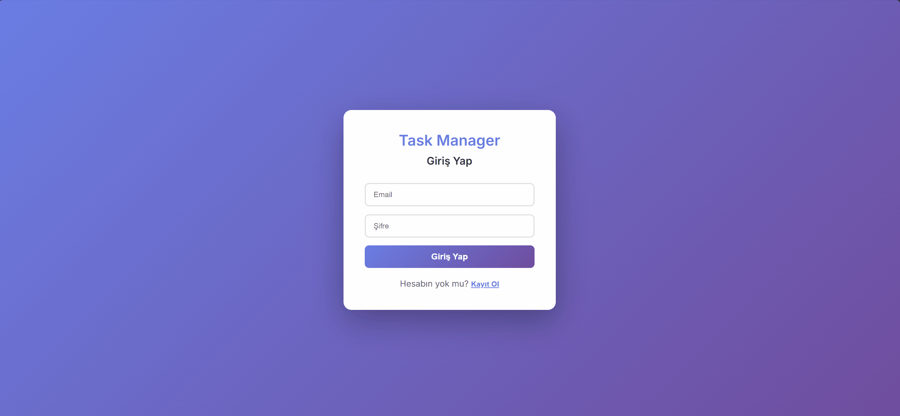

# 🚀 Full-Stack Task Management System


Modern web teknolojileri ve DevOps pratikleri kullanılarak geliştirilmiş; kullanıcı izolasyonuna sahip, containerize edilmiş ve CI/CD süreçleri ile desteklenen bir görev yönetim sistemi.

---

## 📸 Proje Ekran Görüntüsü


---

## 🛠️ Teknolojiler & Araçlar
* **Frontend:** React (Vite), React Router, Axios
* **Backend:** Node.js, Express.js (REST API)
* **Veritabanı:** PostgreSQL
* **DevOps:** Docker, Docker Compose, GitHub Actions (CI/CD)
* **Güvenlik:** JWT, bcrypt, Parameterized Queries

## 🌟 Öne Çıkan Özellikler
* **Dockerized Environment:** `docker-compose` ile tek komutla ayağa kaldırılabilen izole ortam.
* **CI/CD Pipeline:** `GitHub Actions` ile her commit'te otomatik build ve test süreçleri.
* **Güvenli Auth:** JWT tabanlı güvenli giriş/çıkış ve şifreleme.
* **Veri İzolasyonu:** `user_id` bazlı ilişkilendirilmiş veritabanı yapısı.
* **Otomatik Veritabanı:** `init.sql` ile konteyner ilk ayağa kalktığında otomatik tablo kurulumu.
* **Secrets Management:** `.env` ve GitHub Secrets ile hassas verilerin izolasyonu.
## 📦 Kurulum ve Çalıştırma

Proje **Docker** tabanlıdır, sisteminde Docker Desktop'ın kurulu olduğundan emin ol.

### 1. Depoyu Klonlayın
```bash
git clone <repo-url>
cd task-management-project
```
### 2. Ortam Değişkenleri (.env)
### Kök dizinde bir .env dosyası oluştur ve aşağıdaki değişkenleri tanımla:
```
POSTGRES_USER=tuna_user
POSTGRES_PASSWORD=sifre123
POSTGRES_DB=task_db
DATABASE_URL=postgres://tuna_user:sifre123@db:5432/task_db?sslmode=disable
```

### 3. Uygulamayı Başlatın
Sistemi tek komutla ayağa kaldırabilirsin:

```bash
docker compose up -d
```

## 🛡️ DevOps & Güvenlik Mimarisi
SQL Injection Koruması: Backend tarafında pg kütüphanesi ile Parameterized Queries kullanılarak tüm kullanıcı girdileri sanitize edilmiştir.

Otomasyon: .github/workflows/main.yml dosyası ile her push işleminde Docker imajı otomatik build edilir ve test edilir.

Gizlilik: .env dosyası .gitignore ile korunmaktadır, hassas veriler asla repository'e yüklenmez.

## 🗄️ Veritabanı Şeması
Sistem ayağa kalkarken init.sql ile şu şema otomatik oluşturulur:

```SQL
-- 1. Users tablosu 
CREATE TABLE IF NOT EXISTS users (
    id SERIAL PRIMARY KEY,
    email TEXT UNIQUE NOT NULL,
    password TEXT NOT NULL,
    name TEXT,
    created_at TIMESTAMP DEFAULT CURRENT_TIMESTAMP
);

-- 2. Tasks tablosu 
CREATE TABLE IF NOT EXISTS tasks (
    id SERIAL PRIMARY KEY,
    user_id INTEGER NOT NULL REFERENCES users(id) ON DELETE CASCADE,
    title TEXT NOT NULL,
    description TEXT,
    status TEXT DEFAULT 'todo',
    position INTEGER DEFAULT 0,
    created_at TIMESTAMP DEFAULT CURRENT_TIMESTAMP
); 
```
### 👨‍💻 Geliştirici

Tuna Bostancı 

Computer Engineering Student | Full-Stack Developer | DevOps Enthusiast

```Bu proje, modern yazılım geliştirme pratiklerini uygulamak amacıyla geliştirilmiştir.```
